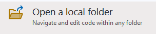
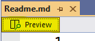
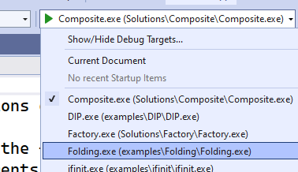
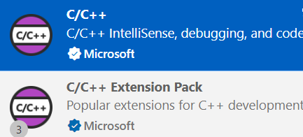

## Introduction
This document provides instructions on using this repository.

The repository is organized int the following directories:
- Labs: Contains the lab assignments.
- Examples: Contains examples of the concepts covered in the course.
- Solutions: Contains the solutions to the labs.

### Viewing Readme Files
The Readme files are written in Markdown format. You can view them directly on GitHub. To view them in Visual Studio Code, right-click on the file and select Open Preview.  To view in Visual Studio, open the file and click the Preview button.

### CMake Environment
The root folder contains a *CMakeLists.txt* file that can be used to build the projects. This file contains the minimum configuration for CMake and the C++ standard required for the projects. Each project in the repository has its own sub-*CMakeLists.txt* file that configures the project.  These files are included in the root *CMakeLists.txt* file using the *add_subdirectory* command.  To speed up builds, feel free to comment out the projects you are not working on.

Each subdirectory *CMakeLists.txt* file is exactly the same and contains the following commands that sets the project name based on the folder name and includes all the source files in the folder in the project:

```cmake
get_filename_component(ProjectName ${CMAKE_CURRENT_SOURCE_DIR} NAME)
string(REPLACE " " "_" ProjectName ${ProjectName})

project(${ProjectName} VERSION 1.0 LANGUAGES CXX)

file(GLOB_RECURSE sources CONFIGURE_DEPENDS "*.cpp")
file(GLOB_RECURSE headers CONFIGURE_DEPENDS "*.h")

# Add the executable
add_executable(${ProjectName} 
    ${sources} 
    ${headers}
)
```


### Visual Studio (Community/Professional/Enterprise)
1. Clone the repository to your local machine.
2. Use the *Open a local folder* option to open the repository. 
3. Open any Readme.md file and click the Preview button to view the file. 
4. Visual Studio will automatically detect the CMAKE environment and configure the project. You can build and run the project from the IDE.
5. Select the project from the dropdown list and click the green arrow to build and run the project. 


### Visual Studio Code
1. Clone the repository to your local machine.
2. Open the repository in Visual Studio Code.
3. Open any Readme.md file and right-click and select Open Preview to view the file.
4. You must have CMAKE already installed on your system. If not, you can download it from [here](https://cmake.org/download/).
5. You must have the C++ extension installed in Visual Studio Code. .
6. You also need to have the CMake Tools extension installed in Visual Studio Code. .
7. When you initially try to build, you will need to choose a kit. Select the kit that has a C++ 20 or greater compitable compiler.

You can find instructions on configuring a C++ environment for different platforms [here](https://code.visualstudio.com/docs/cpp/introvideos-cpp).


### General Comments
The projects will be built using CMAKE and the designated C++ compiler. The IDE may show squiggles under some of the code.  For instance, Visual Studio may show squiggles under the *#include* directives.  This is normal and does not affect the build process.  The squiggles are due to the IDE not being able to find the header files.  The CMAKE build process will find the header files and the project will build successfully.  You can configure the IDE to find the header files, but this is not necessary for the build process.